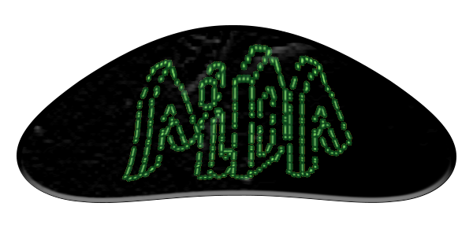

# AiDA - Ambiente de Diálogos Automáticos

## Resumo
Esta ferramenta é um ambiente que possui módulos das ferramentas dos **chatbots** subdivididas em etapas. Aqui devem ser encontradas as ferramentas que participem do funcionamento de um chatbot, até então com objetivo de criar **servidores de chatbots** com acompanhamento de todos os processos de treino de forma independente, tudo isso utilizando a arquitetura de software **pipes and filters**.

## Motivação

A motivação para o desenvolvimento dessa ferramenta inicialmente foi explorar as formas de desenvolvimentos de chatbots para auxílio de departamentos ou setores universitários que necessitassem de distribuir informação para seus consumidores, entretanto, pesando na escalabilidade e pesquisas futuras, veio a ideia de modularizar cada etapa dos chatbots e torná-los desmontáveis e customizáveis.

## Objetivo
O objetivo é dado afim de disponibilizar ferramentas de criação de chatbots, assim como métodos que possam ser acoplados no seus desenvolvimento. Tornando uma ferramenta robusta que possa ser utilizada em diversos setores (tanto na distribuição de informação, quanto no estudo sobre) e utilizando para fins informativos e simplificados.

# Arquitetura

# Estruturação do Arquivo config.json
'''javascript
{
    "name":"nome_da_pasta_modulo",
    "type": "tipo_do_modulo",
    "save": "nome_dos_arquivos_salvos_fora_do_modulo",
    "output": "nome_dos_arquivos_salvos_dentro_do_modulo",
    "arquivos":["path/to/arquivo.json"],
    "image":"nome_da_imagem_docker",
    "version": "versionamento"
}
'''